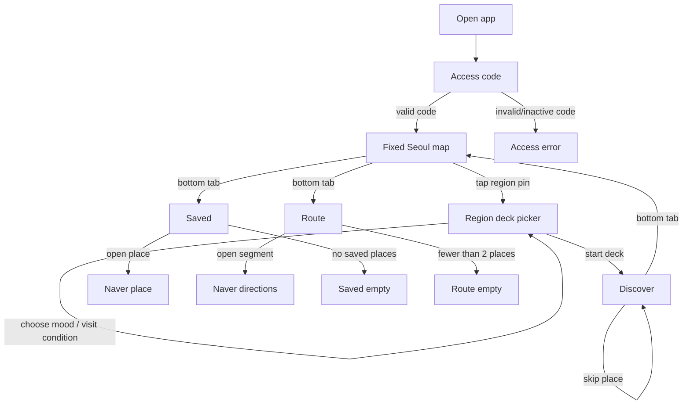

# Doripe MVP Wireframes

Generated: 2026-05-17  
Fidelity: mid-fidelity structure wireframe  
Primary frame: 393 x 852  
Secondary check: 360 x 800

## Answer: Do We Design Every UI?

Not at once.

For MVP, we wireframe every screen in the critical path, plus the states that can break the experience. Then we visually polish the most important screen first.

For Doripe, the order is:

1. Wireframe all MVP flow screens.
2. Make the map-first region/deck selection flow clear.
3. Make Discover/place-card screen high-fidelity.
4. Extend the visual system to Access, Map, Deck Picker, Saved, and Route.
5. Do design QA on real device screenshots.

Update 2026-05-17: the first product screen after access code is now a fixed Seoul map, not Discover.

## MVP Screen Map



## Global Navigation

Bottom tabs:

- Map
- Saved
- Route

Rules:

- Tabs are always available after code verification.
- Map is the default first screen after access code verification.
- Discover starts only after the user chooses a region pin and deck.
- Route tab can show an empty state until at least two places are saved.

## Screen 1A: Fixed Seoul Map

Purpose: make Doripe feel like a map-based neighborhood product before the user starts swiping places.

Regions shown:

- Seongsu
- Yongsan / Huam / Haebangchon
- Yeonnam / Mangwon

Interaction:

- The map is fixed for MVP.
- All three region pins are visible.
- Tapping a pin opens the region deck picker.
- The map does not need full pan/zoom in MVP.

Required states:

- default with all three pins
- selected pin
- unavailable/future region if needed later
- loading deck data

## Screen 1B: Region Deck Picker

Purpose: let the user choose the type of route/deck before Discover begins.

Deck selection can include:

- mood: calm, photo, night, walk
- visit condition: solo, two people, light visit
- optional time: afternoon, evening, night

Interaction:

- Tapping a region pin opens a bottom sheet.
- User selects conditions.
- User taps a deck card or primary CTA.
- Discover starts with places filtered by `selectedDeckId`.

Data integrity rule:

- Region is a canonical entity.
- Deck stores `regionId` and condition tags.
- Discover reads places through `selectedDeckId`.
- Saved/Route store place IDs only, not copied region/deck names.

## Screen 1: Access Code

Purpose: let an invited tester enter Doripe with minimal friction.

```text
┌─────────────────────────────┐
│                             │
│          DORIPE MARK        │
│                             │
│      초대 코드를 입력하세요      │
│   조용한 동네 코스를 먼저 열어볼게요 │
│                             │
│      ┌──┐ ┌──┐ ┌──┐ ┌──┐     │
│      │  │ │  │ │  │ │  │     │
│      └──┘ └──┘ └──┘ └──┘     │
│                             │
│      ┌─────────────────┐    │
│      │       시작       │    │
│      └─────────────────┘    │
│                             │
│   코드는 초대받은 이메일별로 발급돼요 │
│                             │
│  [error area if needed]      │
│                             │
└─────────────────────────────┘
```

Required states:

- default
- typing
- disabled button until 4 digits
- wrong code
- inactive code
- verifying/loading

## Screen 2: Discover

Purpose: make one clear decision: save or skip.

```text
┌─────────────────────────────┐
│ Discover              03/30 │
│ 해방촌 · 카페                │
│                             │
│ ┌─────────────────────────┐ │
│ │                         │ │
│ │      LARGE PHOTO        │ │
│ │                         │ │
│ │                         │ │
│ │  ┌───────────────────┐  │ │
│ │  │ 해방촌 · 카페       │  │ │
│ │  └───────────────────┘  │ │
│ │                         │ │
│ │  오월의 커피             │ │
│ │  언덕 산책 전에 들르기 좋은 │ │
│ │  조용한 카페              │ │
│ │                         │ │
│ │  [차분한] [동네] [혼자]  │ │
│ │                         │ │
│ │  ┌────────┐ ┌────────┐ │ │
│ │  │ 스킵    │ │ 저장    │ │ │
│ │  └────────┘ └────────┘ │ │
│ └─────────────────────────┘ │
│                             │
│ [Discover] [Saved] [Route]  │
└─────────────────────────────┘
```

Required states:

- normal card
- saving disabled/loading
- skipping disabled/loading
- no more cards
- image fallback

Notes:

- The photo should dominate the screen.
- Name and short copy must be readable over the image.
- The save button is the only strong CTA.

## Screen 3: Discover End State

Purpose: avoid a dead end when the tester has seen all seed places.

```text
┌─────────────────────────────┐
│ Discover                    │
│                             │
│ ┌─────────────────────────┐ │
│ │                         │ │
│ │       오늘 준비한 장소를      │ │
│ │       모두 봤어요           │ │
│ │                         │ │
│ │ 저장한 장소로 경로를 만들어볼까요 │ │
│ │                         │ │
│ │ ┌─────────────────────┐ │ │
│ │ │ 저장한 장소 보기        │ │ │
│ │ └─────────────────────┘ │ │
│ │ ┌─────────────────────┐ │ │
│ │ │ 처음부터 다시 보기      │ │ │
│ │ └─────────────────────┘ │ │
│ └─────────────────────────┘ │
│                             │
│ [Discover] [Saved] [Route]  │
└─────────────────────────────┘
```

## Screen 4: Saved

Purpose: review chosen places and open external map/place info.

```text
┌─────────────────────────────┐
│ Saved                       │
│ 저장함                       │
│                             │
│ ┌─────────────────────────┐ │
│ │ 01  [thumb] 오월의 커피    │ │
│ │     언덕 산책 전에 들르기... │ │
│ │     [네이버 지도에서 보기]   │ │
│ └─────────────────────────┘ │
│ ┌─────────────────────────┐ │
│ │ 02  [thumb] 소월길 산책    │ │
│ │     골목과 전망이 이어지는...│ │
│ │     [네이버 지도에서 보기]   │ │
│ └─────────────────────────┘ │
│ ┌─────────────────────────┐ │
│ │ 03  [thumb] 신흥시장 바    │ │
│ │     마무리하기 좋은 작은...  │ │
│ │     [네이버 지도에서 보기]   │ │
│ └─────────────────────────┘ │
│                             │
│ [Discover] [Saved] [Route]  │
└─────────────────────────────┘
```

Required states:

- saved list
- empty saved list
- external link failure
- long Korean place name

## Screen 5: Saved Empty

```text
┌─────────────────────────────┐
│ Saved                       │
│ 저장함                       │
│                             │
│ ┌─────────────────────────┐ │
│ │                         │ │
│ │   아직 저장한 장소가 없어요    │ │
│ │   마음에 드는 장소를 저장하면  │ │
│ │   여기에서 다시 볼 수 있어요   │ │
│ │                         │ │
│ │   ┌─────────────────┐   │ │
│ │   │ 장소 보러가기      │   │ │
│ │   └─────────────────┘   │ │
│ └─────────────────────────┘ │
│                             │
│ [Discover] [Saved] [Route]  │
└─────────────────────────────┘
```

## Screen 6: Route

Purpose: show a simple visit order and hand off directions to Naver.

```text
┌─────────────────────────────┐
│ Route                       │
│ 저장한 장소를 방문하기 좋은 순서로 │
│ 연결해요                       │
│                             │
│ ┌─────────────────────────┐ │
│ │        ROUTE PREVIEW     │ │
│ │                         │ │
│ │    ①──────②              │ │
│ │            │             │ │
│ │            └────③        │ │
│ │                         │ │
│ └─────────────────────────┘ │
│                             │
│ 구간                         │
│ ┌─────────────────────────┐ │
│ │ ① 오월의 커피 → 소월길 산책 │ │
│ │   [네이버 길찾기]          │ │
│ └─────────────────────────┘ │
│ ┌─────────────────────────┐ │
│ │ ② 소월길 산책 → 신흥시장 바 │ │
│ │   [네이버 길찾기]          │ │
│ └─────────────────────────┘ │
│                             │
│ [Discover] [Saved] [Route]  │
└─────────────────────────────┘
```

Required states:

- 2 saved places
- 3+ saved places
- fewer than 2 saved places
- map preview fallback
- external Naver directions failure

Copy rule:

- Do not say "최적 경로".
- Use "방문하기 좋은 순서" or "저장한 순서 기반".

## Screen 7: Route Empty

```text
┌─────────────────────────────┐
│ Route                       │
│                             │
│ ┌─────────────────────────┐ │
│ │                         │ │
│ │   경로를 만들려면 장소를      │ │
│ │   2개 이상 저장해야 해요      │ │
│ │                         │ │
│ │   ┌─────────────────┐   │ │
│ │   │ 장소 보러가기      │   │ │
│ │   └─────────────────┘   │ │
│ └─────────────────────────┘ │
│                             │
│ [Discover] [Saved] [Route]  │
└─────────────────────────────┘
```

## Component Inventory

### AccessCodeInput

- 4 cells
- numeric keyboard
- masked or plain digits: plain is better for short test code
- error text below

### PlaceCard

- cover image
- metadata chip
- place name
- short copy
- mood chips
- skip button
- save button

### BottomTab

- 3 destinations only
- selected state must be obvious
- touch target at least 48dp

### SavedPlaceRow

- order number
- thumbnail/marker
- place name
- short copy
- external map button

### RouteMapPreview

- numbered pins
- connecting line
- no heavy map detail in wireframe
- fallback-friendly

### RouteSegment

- start place
- end place
- estimated mode label optional
- Naver directions CTA

## What To Build Next

1. Convert these wireframes into Figma frames.
2. Choose one high-fidelity direction for Discover.
3. Apply the visual language to shared components.
4. Implement in the React Native app.
5. Screenshot compare and fix.

## HTML Preview

A simple visual wireframe preview is available at:

`docs/design/wireframes/doripe-mvp-wireframe.html`
